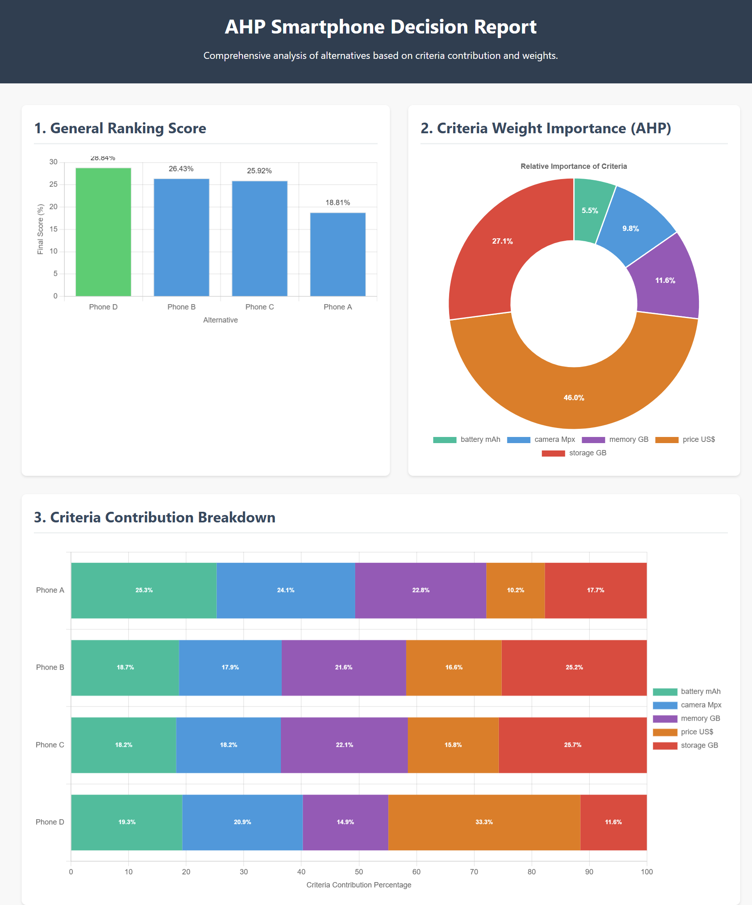

# AHPd CLI — Data-Driven Multi-Criteria Decision System 💡


The **AHPd Command Line Interface (CLI)** provides a high-performance, platform-agnostic way to integrate the **AHPd** (Analytic Hierarchy Process Data-Driven) decision engine into automated pipelines, scripts, and real-time data processing workflows.

Built on an optimized core, the CLI ensures **100% objective, consistent, and auditable** multi-criteria decision-making based purely on statistical data analysis.

## 🚀 Getting Started

The AHPd CLI executable is named **`ahpd`** (Linux) or **`ahpd.exe`** (Windows).

#### Help Command ❓

To see the list of available commands and options, use the help flag:

```bash
ahpd --help
# or
ahpd.exe --help
```

#### Basic Execution Examples ⚙️

The CLI supports three primary methods for data input: loading from a **file**, receiving via **pipe (standard input)**, or providing data **inline**. In all cases, the input must be a valid AHPd **JSON structure**.

| Input Method | Linux Example | Windows Example |
| :--- | :--- | :--- |
| **File** | `ahpd json -f phones.json` | `ahpd.exe json -f phones.json` |
| **Pipe (Stdin)** | `cat phones.json \| ahpd json` | `cat phones.json \| ahpd.exe json` |
| **Inline Data** | `ahpd inline -i '{"data":{...}}'` | `ahpd.exe inline -i '{"data":{...}}'` |

## 📥 Data Input Structure and Methods

The CLI utilizes subcommands (`json` or `inline`) to specify the data ingestion method, followed by various options to control input, output, and execution mode.

#### Input Commands Reference 📖

| Command | Description | Input Option |
| :--- | :--- | :--- |
| **`json`** | Used for reading JSON data from a **file** (`-f`) or from **Standard Input (pipe)**. | `-f <file_path>` |
| **`inline`** | Used for providing the complete JSON data structure directly as an **inline string**. | `-i '<json_string>'` |

#### Mandatory JSON Structure 📐

The AHPd CLI requires the input data to adhere to a strict structure containing the mandatory keys: **`data`**, **`criteria`**, and **`options`**.

```json
{
  "data": {
    "criteria": {
      "price US$": "min",
      "storage GB": "max",
      "memory GB": "max",
      "camera Mpx": "max",
      "battery mAh": "max"
    },
    "options": {
      "Phone A": [9494, 128, 6, 48, 4323],
      "Phone B": [4139, 256, 8, 50, 4500],
      "Phone C": [4429, 256, 8, 50, 4300],
      "Phone D": [1885, 128, 6, 64, 5065]
    }
  }
}
```

##### Structure Rules 🔗

1.  **`criteria` (Object):** Defines the quantitative criteria for the decision.

      * **Keys (Criterion Name):** Must be a **string**.
      * **Values (Preference):** Must be a **string** and restricted to only: **`"min"`** (lower value is better, e.g., price) or **`"max"`** (higher value is better, e.g., performance).

2.  **`options` (Object):** Contains the raw, quantitative data for each alternative.

      * **Keys (Alternative Name):** Must be a **string**.
      * **Values (Data Array):** Must be an **array of numbers** (f64 precision, negatives accepted).
      * **Positional Coherence:** The values in this array **must strictly match** the order of the criteria defined in the **`criteria`** object.

#### Full Inline Example 💻

```bash
# Complete example with inline JSON data
ahpd inline -i '{"data":{"criteria":{"price US$":"min","storage GB":"max","memory GB":"max","camera Mpx":"max","battery mAh":"max"},"options":{"Phone A":[9494,128,6,48,4323],"Phone B":[4139,256,8,50,4500],"Phone C":[4429,256,8,50,4300],"Phone D":[1885,128,6,64,5065]}}}'
```

### Example visual (with Chart.js)

This simple example demonstrates the decision to purchase a device, comparing the features that the **user considers relevant**.

| Option  | price US$ (min) | storage GB (max) | memory GB (max) | camera Mpx (max) | battery mAh (max) |
|----------|-----------------|------------------|------------------|------------------|-------------------|
| Phone A  | 9494            | 128              | 6                | 48               | 4323              |
| Phone B  | 4139            | 256              | 8                | 50               | 4500              |
| Phone C  | 4429            | 256              | 8                | 50               | 4300              |
| Phone D  | 1885            | 128              | 6                | 64               | 5065              |

Note that the data was passed **without** any transformation, **without** normalization, **exactly as it is in the real world**.

The user only needed to indicate whether a lower "price" is better or a larger "battery" is better.

The screenshot below intuitively shows the results, allowing you to see **precisely how much each feature (criterion)** contributed to the final ranking score. **This visually validates the weights calculated by AHPd**.



## 🧾 Practical Use Cases

| Area | Application | Strategic Outcome |
| :--- | :--- | :--- |
| **Finance** | Comparing investments based on return, risk, and liquidity. | Optimized portfolio construction and risk alignment. |
| **IT & Engineering** | Selecting vendors, software architectures, or technologies. | Reduced deployment costs and increased system efficiency. |
| **Operations** | Choosing optimal equipment, routes, or maintenance strategies. | Streamlined efficiency and reduced operational overhead. |
| **Product & Marketing** | Prioritizing features, analyzing competitor products, or setting prices. | Data-driven product roadmaps and competitive advantage. |
| **HR & Procurement** | Evaluating candidate suitability or selecting raw material suppliers. | Consistent, measurable selection criteria. |

## 📤 Output Formatting and Control

You have control over the level of detail (`--level`), the output destination (`--output`), and formatting (`--pretty`).

#### Output Levels (`--level`) 📈

This option defines which results are included in the JSON output (default is **`rank`**).

| Level Name | Abbreviation | Description |
| :--- | :--- | :--- |
| **`rank`** | `r` | The final normalized percentage ranking of all alternatives. |
| **`contribution-global`** | `g` or `global` | The automatically calculated **weight/importance** of each criterion. |
| **`contribution-detailed`** | `d` or `detailed` | The percentage contribution of each criterion to each alternative's score (Auditability). |

**Usage Examples:**

```bash
# Explicitly define desired output levels
ahpd json -f phones.json --level rank contribution-global contribution-detailed

# Use combined or abbreviated forms
ahpd json -f phones.json --level r global
ahpd json -f phones.json --level rgd
```

**Output example:*
```json
{
  "contribution": {
    "alternatives_contribution": {
      "by_criteria": {
        "Phone A": {
          "battery mAh": 25.27140468399798,
          "camera Mpx": 24.073235745226988,
          "memory GB": 22.7835981160184,
          "price US$": 10.151185142297878,
          "storage GB": 17.720576312458753
        },
        "Phone B": {
          "battery mAh": 18.725026772638852,
          "camera Mpx": 17.849621957062656,
          "memory GB": 21.623542027984474,
          "price US$": 16.57434354299879,
          "storage GB": 25.227465699315214
        },
        "Phone C": {
          "battery mAh": 18.24259984226682,
          "camera Mpx": 18.198574261252137,
          "memory GB": 22.046272819345443,
          "price US$": 15.791901454565918,
          "storage GB": 25.720651622569683
        },
        "Phone D": {
          "battery mAh": 19.309583049401244,
          "camera Mpx": 20.932567729107106,
          "memory GB": 14.85838512914299,
          "price US$": 33.34294232523744,
          "storage GB": 11.556521767111215
        }
      },
      "total_percentage": {
        "Phone A": 18.810524412740325,
        "Phone B": 26.42622428319317,
        "Phone C": 25.91950921187671,
        "Phone D": 28.843742092189796
      }
    },
    "criteria_weights": {
      "battery mAh": 0.05517554629857757,
      "camera Mpx": 0.09811746760930982,
      "memory GB": 0.11601983189243667,
      "price US$": 0.4599742131173236,
      "storage GB": 0.27071294108235233
    }
  },
  "rank": {
    "Phone A": 0.14922568130663832,
    "Phone B": 0.260912125126531,
    "Phone C": 0.25370960371891654,
    "Phone D": 0.336152589847914
  }
}
```

#### Output Destination (`--output`) 💾

| Value | Description |
| :--- | :--- |
| **`inline`** | Writes the result to **Standard Output (stdout)** (default behavior). |
| **`<filename>`** | Writes the result to the specified file (adds `.json` if no extension is given). |

**Usage Examples:**

```bash
# Pretty-print to standard output
ahpd json -f phones.json --pretty --output inline

# Output to a file named 'results.json' with only the detailed contribution data
ahpd json -f phones.json --level detailed --output results.json
```

#### Other Control Options 🚦

| Option | Description |
| :--- | :--- |
| **`--pretty`** | Adds formatting (indentation and line breaks) to the JSON output for human readability. |
| **`--check`** | Performs structural **validation** of the input JSON data only. **The AHPd calculation is skipped.** |

**Validation Example:**

```bash
# Structural validation only via pipe
cat phones.json | ahpd json --check
```

## 🔎 Output Auditability and Precision

The AHPd output is designed to be **consistent, auditable, and highly precise**, relying on **f64 (double-precision floating-point)** numbers for mathematical integrity.

#### Understanding the Output Fields 🔍

The JSON output contains three core fields, corresponding to the requested output levels:

1.  **`criteria_weights` (Global Contribution - `g`):** The **automatic weights** (importance) assigned by AHPd based on data dispersion. The sum of all weights equals $1.0$.
2.  **`rank` (Rank - `r`):** The final, normalized **priority vector** (ranking) of each alternative. The sum of all scores equals $1.0$.
3.  **`alternatives_contribution` (Detailed Contribution - `d`):** The full **audit trail** for the decision, detailing how much each criterion contributed to the total score of each alternative.

#### Execution and Analysis Example 🧪

**Command Executed:**

```bash
ahpd.exe json -f phones.json --level rdg --output results.json --pretty
```

**Output Analysis (Excerpt from `results.json`):**

| Field/Value | Detail | Interpretation |
| :--- | :--- | :--- |
| **`criteria_weights`** | `price US$`: **0.459974** | **Price** received the highest weight (most important factor), meaning its values showed the greatest statistical difference among alternatives. |
| **`rank`** | `Phone D`: **0.336153** | **Phone D is the Winner**. It achieved the highest overall performance score (rank). |
| **`Phone D`** contribution: | `price US$`: **33.34%** | **Auditability:** $33.34\%$ of Phone D's total performance comes from its lower price, which confirms *why* it won—its strong performance on the most important criterion. |

## 🗺️ Other Integration Options

While the CLI is ideal for automation, AHPd is platform-agnostic, supporting several integration paths:

| Type | Description | Link |
| :--- | :--- | :--- |
| **PHP Native Extension** | Native C/Rust implementation for maximum performance within PHP systems. | [View PHP Documentation](https://github.com/weadtech/ahpd_lib) |
| **REST API** | JSON-compatible web service for integration with any programming language or BI tool. | [Online Service](https://ahpbi.wead.tech/api-rest) |
| **GUI Application** | Desktop application for end-user analysis and reporting. | *(Planned)* |

## 🧬 Licensing & Availability

The **use** and **distribution** of the AHPd system are free for both personal and commercial purposes. Compiled binaries, extensions, and packaged libraries may be integrated into third-party products or services without additional licensing fees.

However, the high-performance computational core and underlying source code remain the **exclusive intellectual property of Wead Technology®**, ensuring integrity, consistency, and continuous innovation.

### Required Attribution

For the use of AHPd, **mandatory attribution** to Wead Technology® must be included in your documentation, "About" section, or any licensing notices related to the product that integrates it.

### Enterprise Services

Enterprise-grade services — including **dedicated technical support**, **OEM integration**, **private cloud APIs**, and **performance optimization** — are available for organizations seeking enhanced scalability, reliability, and assistance.

For partnerships, large-scale deployments, or OEM licensing, contact Wead Technology® to discuss collaboration opportunities.
